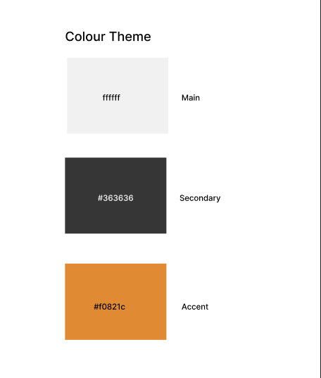

# Hailey's Recipes

Hailey’s Recipes is a recipe website I built as part of my web development diploma. It's a simple site where you can search and explore different recipes.

---

##  What This Project Is

This website lets you:
- **Search for recipes** using keywords (like "chicken" or "vegan")
- **Filter recipes** by category (like "Dinner", "Breakfast", etc.)
- **View recipes** as cards with a picture, title, short description, and rating

I made it because I wanted to learn how to build websites that are both useful and nice to look at. It’s designed to work well on phones, tablets, and computers.

---

## User Stories

These user stories describe the features and functionality of the application from the end-user’s perspective.

### As a visitor:
- As a user I want to search for a recipe using a keyword, so I can find relevant meal ideas quickly.
- As a user I want to browse popular or featured recipes on the homepage.

---

## What the Website Looks Like & Functionality Overview

### Search Bar
- Right near the top
- Type in what you’re looking for (like “pasta”) and it filters recipes right away

### Recipe Cards
- Each card shows:
  - A recipe picture
  - The name of the recipe
  - A short description
  - A category tag (like “Dinner”)

### Works on Any Device
- Whether you’re on your phone or laptop, the layout adjusts to fit your screen

---

## How It All Works

- **Search bar:** As you type, the list of recipes updates right away — no need to press Enter!
- **Navigation bar:** Has links to different pages like Home, Recipes, and About

---

## Where I Got Design Ideas

- Wep page designs by (https://dribbble.com)
- Markdown Guide by (https://www.markdownguide.org/basic-syntax/)

These helped me figure out how to keep things simple and clean.

---

## API
- There is a charge for the API from https://www.themealdb.com/ therefore I have created a sample JSON file that represents the data.

## Credits
- Logo by Canva
- Icons by https://icons8.com
- Show instructions and display in a numbered steps sequence credits to StackOverflow and YouTube.
- Sample ingredients list credit to https://www.themealdb.com/

---
## What I Used to Build This

- **HTML** — for the structure
- **CSS** — for the styling
- **JavaScript** — to make it interactive
- **Figma** — to plan the design and layout

---

## Figma Files

  <strong>Colour Theme</strong> 
  

  <strong>Home Page Wireframe</strong> 
  

   

  <strong>Recipe Page Wireframe</strong> 
  

  <strong>About Page Wireframe</strong> 
  

  <strong>Tablet Home Page Wireframe</strong> 
  

  <strong>Mobile Home Page Wireframe</strong> 
  

  <strong>Mobile Recipe Page Wireframe</strong> 
  

  <strong>Home Page Hi-Fi</strong> 
  

  <strong>Recipe Page Hi-Fi</strong> 
  

  <strong>About Page Hi-Fi</strong> 
  

---

## Color Palette

I chose this color palette to create a clean, modern, and inviting recipe browsing experience. Since the focus of the site is on food, I kept the background mostly white to let the vibrant recipe images pop. Here's a breakdown of the reasoning behind the choices:

- **White background**  
  Keeps everything feeling open, fresh, and minimal. It puts the spotlight on the food and makes the interface easier to scan.

- **Orange**  
  This gives a welcoming, energetic feel. Orange is often associated with appetite and positivity. I used it sparingly to highlight actions like filters and “Load More Recipes” without being overwhelming.

- **Dark grey and black text**  
  Used for strong readability and contrast against the white background. Keeps the content professional and easy to navigate.

  ---

## Testing: Manual vs Automated

To make sure this website works correctly and looks great, we need to test it to ensure everything works.

### Manual Testing – Test by Hand

This is when you manually test the website.

#### Use manual testing for:

- User experience (UX)
- Layout and design
- Quick checks
- Open the site
- Try searching recipes
- Click recipe cards
- Submit the contact form

---

### Automated Testing by using code

Automated testing uses tools like Jest to test the logic.

#### Use automated testing for:

- Reusable functions
- Quick, repeatable checks
- Avoiding bugs after changes

---

## Test 

This test plan checks the website for functionality, usability, and responsiveness.

### 1. Functionality – Does everything work?

1. Open the home page – Recipes load automatically from the JSON file.
2. Use the search bar – Typing something like "chicken" it filters the recipes.
3. Click a recipe card – Takes you to the detailed recipe page.
4. Check the recipe page – Ingredients and steps should show properly.
5. Fill out the contact form – After clicking "Send", an alert appears and the form resets.
6. Click navigation links – Takes you to the correct pages.
7. Loading - Whilst recipes are loading the spinner shows.
8. No data - If there isnt any data or recipes found a message displays highlighting that.

---

### 2. Usability – Is the site easy to use?

1. Look at the layout – Its clean and easy to follow.
2. Try the contact form – Fields are easy to understand and fill.
3. Use the search bar – Results displays and is fast.
4. Click around the nav bar – Displays which page you're on.
5. Check buttons and links – Easy to click.

---

### 3. Responsiveness – Does it work on different screen sizes?

1. Open on a mobile phone – Layout adjusts and be readable.
2. Open on a tablet – Everything looks clean and fits the screen.
3. Open on a desktop – Page fills the space nicely.
4. Use the hamburger menu on small screens – It opens and show the nav links.

---

### 4. Re-check After Changes

1. After making changes to the code or styles, go through these steps again.
2. Make sure search, recipes, and the contact form still work as expected.

---

## Screenshots of validation

  <strong>index.html</strong> 
  

  <strong>recipe.html</strong> 
  

  <strong>about.html</strong> 
  

  <strong>CSS</strong> 
  

  <strong>JavaScript</strong> 
  

---

## Screenshots of working project

  <strong>index.html</strong> 
  

  <strong>recipe.html</strong> 
  

  <strong>about.html</strong> 
  

  <strong>Search Meal</strong> 
  

     
  <strong>Search Ingredient</strong> 
  

  <strong>No Recipe Found Message</strong> 
  

  <strong>About Message Input Field</strong> 
  

  <strong>About Message Input Field Error</strong> 
  

  <strong>About Message Sent Alert</strong> 
  

  <strong>Recipe Not Selected</strong> 
  

 
---

## GitHub Pages Live Link of working project
-- https://basit-dev.github.io/Haileys-Recipes/index.html
